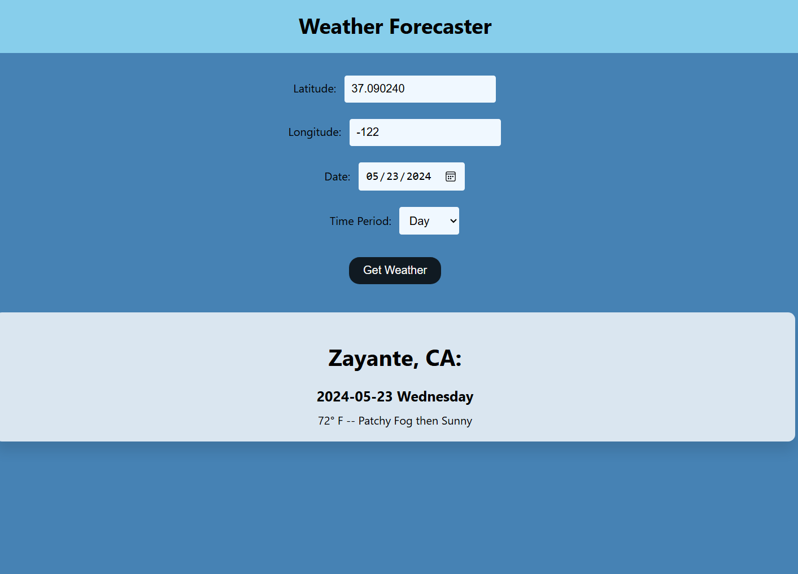

# Weather Forecast App for Data Society

This solution takes in values to determine the weather at that location during the time period the user has selected

## In order to run the application:
- Clone the GitHub repository
- Navigate to the directory
- Run ``` npm install ```
- Run ``` npm start ```


# App

This application utilizes ReactJS, Axios and the National Weather Service API (https://www.weather.gov/documentation/services-web-ap) to retrieve weather forecasts and location. 

It takes in: latitude, longitude, a date and a time period between 'day' and 'night' and outputs the city, state and the forecasted temperature and subsequent details. 


